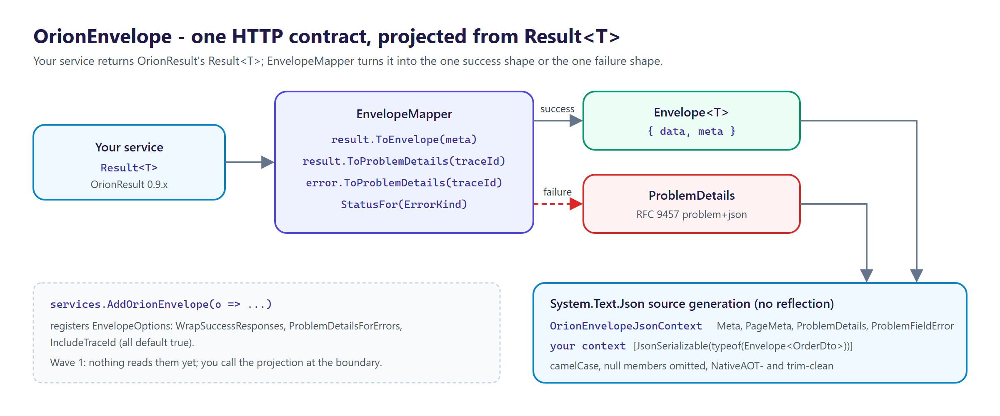
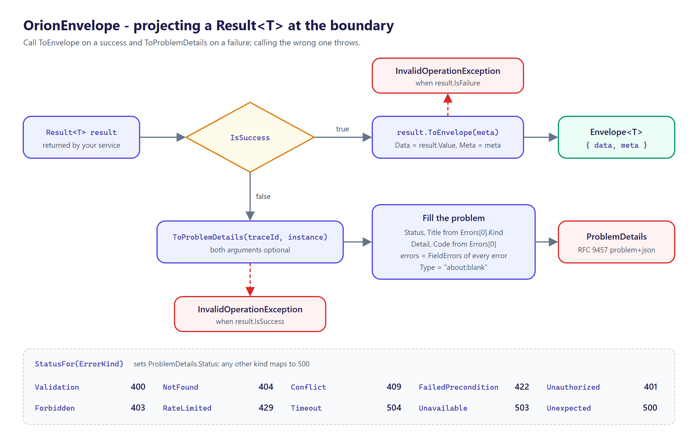

<p align="center">
  <picture>
    <source media="(prefers-color-scheme: dark)" srcset="docs/logo.png">
    
  </picture>
</p>

# OrionEnvelope

[](https://github.com/tunahanaliozturk/OrionEnvelope/actions/workflows/ci-cd.yml)
[](https://www.nuget.org/packages/OrionEnvelope/)
[](LICENSE)


**One HTTP contract for the whole API.** Every success is a typed `{ data, meta }`, every failure is an RFC 9457 `problem+json`, and pagination metadata rides in the same envelope — projected mechanically from [OrionResult](https://github.com/tunahanaliozturk/OrionResult)'s `Result<T>`, not hand-serialized per endpoint.

An API with 80 endpoints written by six people has 80 slightly different response shapes: some return the bare object, some `{ data }`, some `{ result, success, error }`; errors are a plain string here, a `{ message }` there, a stack trace in prod somewhere else. The cost is real — every client writes bespoke unwrapping, error handling can't be centralized, and no OpenAPI consumer can generate a clean typed client. ASP.NET Core ships `ProblemDetails`, but nothing enforces it on every error path and nothing standardizes the *success* envelope or where pagination lives. OrionEnvelope makes the envelope a **projection, not a chore**: an endpoint that returns a `Result` is correctly shaped with zero envelope code.



## Features

- **`Envelope<T>`** — `{ "data": ..., "meta": ... }`, one success shape for the whole API.
- **RFC 9457 `ProblemDetails`** — one failure shape, with the family extensions `traceId` and per-field `errors`.
- **`Result<T>` projection** — `result.ToEnvelope()` on success, `result.ToProblemDetails()` on failure, with each `OrionResult` `ErrorKind` mapped to its HTTP status (validation→400, not-found→404, conflict→409, rate-limited→429, …).
- **Pagination in the same envelope** — `meta.page` carries `nextCursor`/`hasMore`, so paging is part of the one contract.
- **Source-gen JSON, AOT-clean** — the wire types serialize through a `System.Text.Json` source-gen context with no reflection fallback (verified by a NativeAOT smoke test). Multi-targets `net8.0`, `net9.0`, `net10.0`.

## Install

```bash
dotnet add package OrionEnvelope
```

| Package | What it is |
|---------|------------|
| `OrionEnvelope` | `Envelope<T>`, `Meta`, `ProblemDetails`, the `Result<T>` projection (`EnvelopeMapper`), the source-gen JSON context and `AddOrionEnvelope` |

## Usage

Return `Result<T>` from your services and project it at the boundary:



```csharp
using Moongazing.OrionEnvelope;
using Moongazing.OrionResult;

Result<OrderDto> result = await orders.GetAsync(id, ct);

if (result.IsSuccess)
{
    Envelope<OrderDto> ok = result.ToEnvelope(new Meta { TraceId = traceId });
    // 200 → { "data": { ... }, "meta": { "traceId": "..." } }
}
else
{
    ProblemDetails problem = result.ToProblemDetails(traceId);
    // e.g. 404 application/problem+json → { "type":"about:blank","title":"Not Found","status":404,"detail":"...","traceId":"...","code":"..." }
}
```

Fold pagination into the same envelope:

```csharp
var meta = new Meta { TraceId = traceId, Page = new PageMeta(nextCursor, hasMore) };
var envelope = Envelope.Ok(items, meta);
// { "data": [ ... ], "meta": { "traceId": "...", "page": { "nextCursor": "eyJ...", "hasMore": true } } }
```

The `EnvelopeResultFilter` / minimal-API filter that applies this automatically (no per-endpoint code), the exception→`problem+json` mapper, and the OpenAPI schema contribution arrive in later waves; today you call the projection at the boundary. `services.AddOrionEnvelope(o => ...)` (add `using Moongazing.OrionEnvelope.DependencyInjection;`) already registers `EnvelopeOptions` (`WrapSuccessResponses`, `ProblemDetailsForErrors`, `IncludeTraceId`, all `true` by default) so the DI convention is stable, but nothing in Wave 1 reads those options yet.

## AOT-clean serialization

`Envelope<T>` is generic, so its payload type is application-specific: add your payload types to a source-gen context and serialize through the typed `JsonTypeInfo`.

```csharp
using System.Text.Json;
using System.Text.Json.Serialization;
using Moongazing.OrionEnvelope;

// AOT-safe: use the typed JsonTypeInfo overloads, not the JsonSerializerOptions ones.
Envelope<OrderDto> envelope = Envelope.Ok(order, new Meta { TraceId = traceId });
string json = JsonSerializer.Serialize(envelope, ApiJson.Default.EnvelopeOrderDto);

[JsonSourceGenerationOptions(PropertyNamingPolicy = JsonKnownNamingPolicy.CamelCase,
                             DefaultIgnoreCondition = JsonIgnoreCondition.WhenWritingNull)]
[JsonSerializable(typeof(Envelope<OrderDto>))]
[JsonSerializable(typeof(ProblemDetails))]
public partial class ApiJson : JsonSerializerContext;
```

The library ships `OrionEnvelopeJsonContext` covering the non-generic types (`Meta`, `PageMeta`, `ProblemDetails`, `ProblemFieldError`).

## Roadmap

This is the **Wave 1** foundation (v0.1): the `Envelope<T>` / `Meta` / `ProblemDetails` types, the `Result<T>` → envelope / problem projection, and source-gen AOT-clean serialization. Later waves add the RFC 9457 exception mapper + a stable error-type-URI taxonomy with production-safe (no-leak) details (W2), the minimal-API + MVC filters that wrap automatically, the OpenAPI schema, and automatic `OrionPage` `Page<T>` → `meta.page` folding (W3, GA), then content negotiation and versioned envelopes (W4). See [CHANGELOG.md](CHANGELOG.md).

OrionEnvelope defines shapes; it delegates serialization to `System.Text.Json`. It is not a validation library (validation errors arrive as `Result.Error` from [OrionGuard](https://github.com/tunahanaliozturk/OrionGuard)), not HATEOAS, and HTTP/JSON only.

## Versioning

Follows [Semantic Versioning](https://semver.org/). Multi-targets `net8.0`, `net9.0`, and `net10.0`. Binds to `OrionResult` 0.9.x.

## Documentation

- [CHANGELOG.md](CHANGELOG.md) — release notes.
- [SECURITY.md](SECURITY.md) — how to report a vulnerability privately.

## Contributing

Contributions are welcome. See [CONTRIBUTING.md](CONTRIBUTING.md) and the [CODE_OF_CONDUCT.md](CODE_OF_CONDUCT.md).

## More from the Orion family

Focused .NET libraries built to one quality bar. Each is usable on its own; several share the small [`Orion.Abstractions`](https://github.com/tunahanaliozturk/Orion.Abstractions) contracts spine, but there is no deep dependency web — pick only what you need:

- [OrionResult](https://github.com/tunahanaliozturk/OrionResult) — Result/Option types and a shared error vocabulary (projected by this package)
- [OrionPage](https://github.com/tunahanaliozturk/OrionPage) — keyset/cursor pagination (folds into `meta.page`)
- [Orion.Abstractions](https://github.com/tunahanaliozturk/Orion.Abstractions) — the shared contracts spine: telemetry, options, result, clock
- [OrionClock](https://github.com/tunahanaliozturk/OrionClock) — a `TimeProvider`-based clock with TTL / deadline vocabulary
- [OrionResilience](https://github.com/tunahanaliozturk/OrionResilience) — retry, backoff, and timeout on OrionClock
- [OrionRate](https://github.com/tunahanaliozturk/OrionRate) — rate limiting on OrionClock
- [OrionGuard](https://github.com/tunahanaliozturk/OrionGuard) — validation, guard clauses, DDD primitives, domain events
- [OrionAudit](https://github.com/tunahanaliozturk/OrionAudit) — automatic EF Core change-audit trail
- [OrionBeacon](https://github.com/tunahanaliozturk/OrionBeacon) — leader election with fencing tokens
- [OrionGrant](https://github.com/tunahanaliozturk/OrionGrant) — permission / authorization checks
- [OrionInbox](https://github.com/tunahanaliozturk/OrionInbox) — transactional inbox for exactly-once effects
- [OrionKey](https://github.com/tunahanaliozturk/OrionKey) — source-generated strongly-typed IDs
- [OrionLedger](https://github.com/tunahanaliozturk/OrionLedger) — API-key issuance, verification, and rotation
- [OrionLens](https://github.com/tunahanaliozturk/OrionLens) — ambient correlation-context propagation (source of `meta.traceId`)
- [OrionLock](https://github.com/tunahanaliozturk/OrionLock) — distributed locks with fencing tokens
- [OrionOnce](https://github.com/tunahanaliozturk/OrionOnce) — idempotency keys for exactly-once request handling
- [OrionPatch](https://github.com/tunahanaliozturk/OrionPatch) — transactional outbox for EF Core
- [OrionRelay](https://github.com/tunahanaliozturk/OrionRelay) — outbound webhook delivery (HMAC, retries, backoff)
- [OrionSaga](https://github.com/tunahanaliozturk/OrionSaga) — sagas / process managers for long-running workflows
- [OrionShade](https://github.com/tunahanaliozturk/OrionShade) — sensitive-data redaction for logs and telemetry
- [OrionStream](https://github.com/tunahanaliozturk/OrionStream) — server-sent events / streaming hub
- [OrionVault](https://github.com/tunahanaliozturk/OrionVault) — field-level encryption for EF Core

See it all working together in [OrionShowcase](https://github.com/tunahanaliozturk/OrionShowcase), a production-shaped banking sample.

## License

[MIT](LICENSE).
